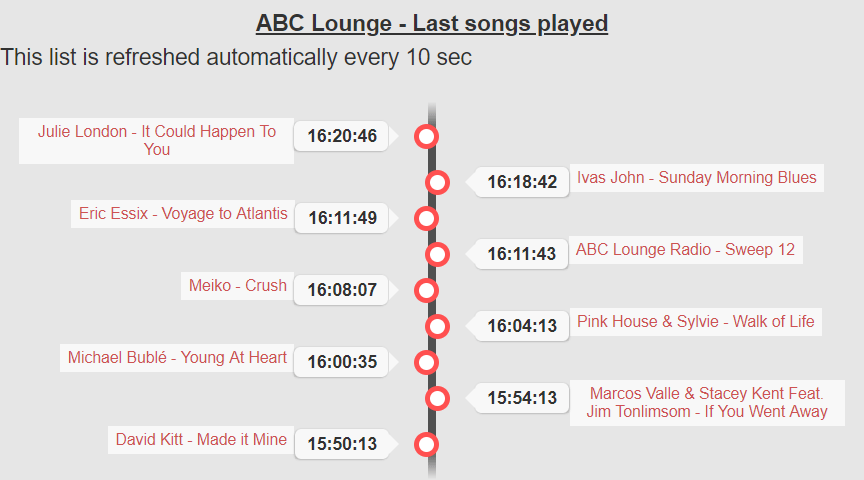

# shoutcast-song-history

The tracklist is automatically refreshed every 10 sec thanks to AJAX.
Easy to customize. No database needed.
Launch index.php to see an exemple of tracklist history.

Looks like : 

Demo here : https://toutes-les-radios.fr/?genre=top50&name=La%20Radio%20Sympa&cover=laradiosympa.jpg&url=http://radio2.pro-fhi.net:9095&path=/stream2&streamid=1&type=shoutcast2

Features : 
- SIMPLE HTML DOM
- JQUERY
- AJAX
- RESPONSIVE
